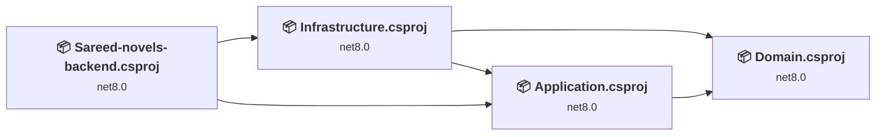
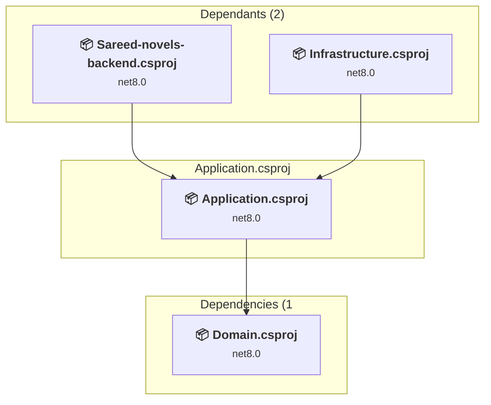
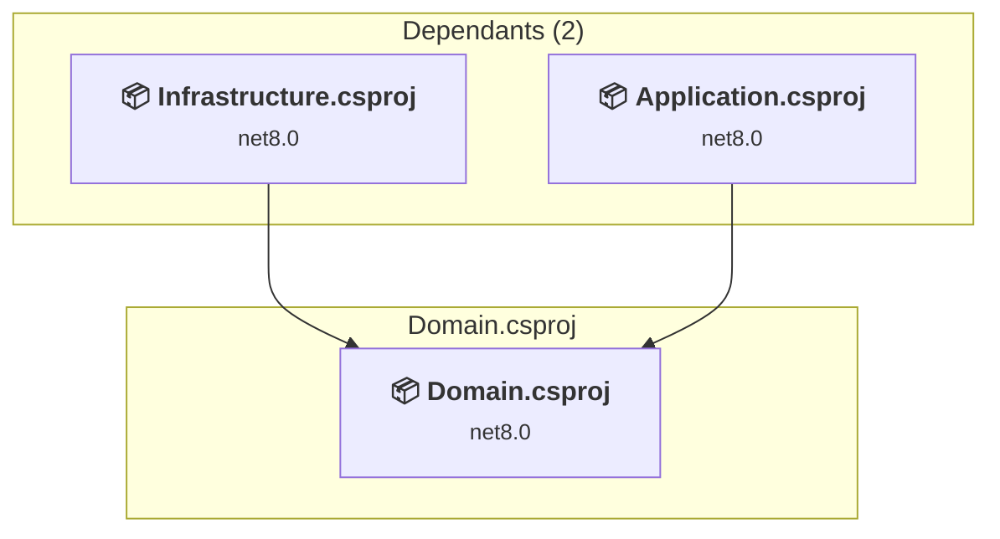
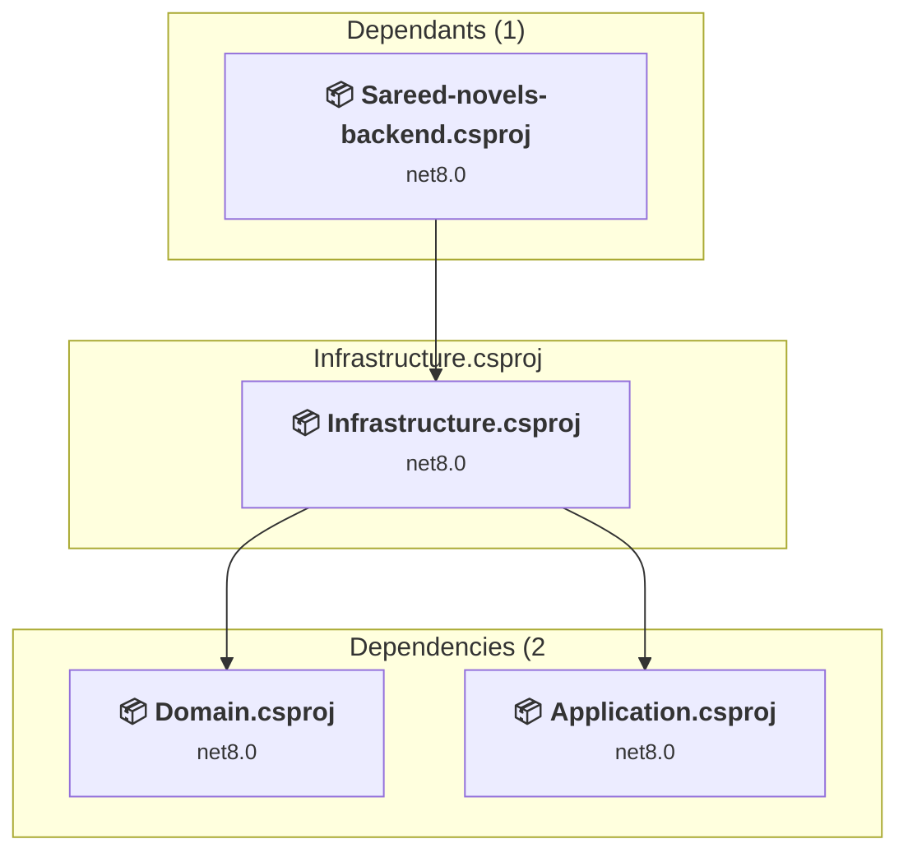
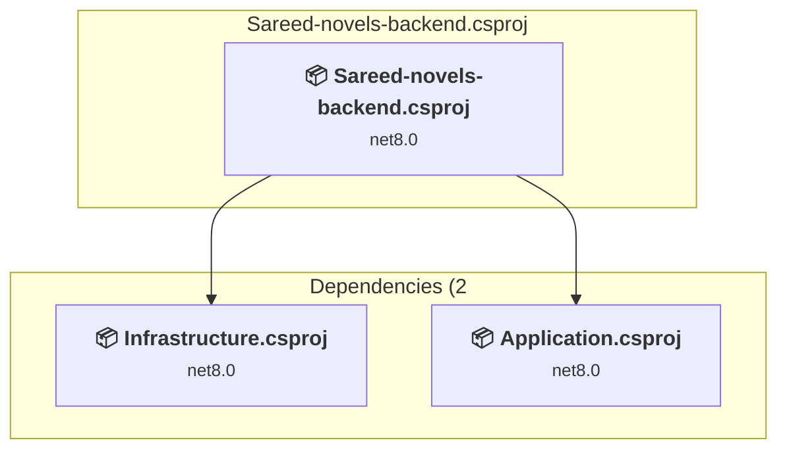

# Projects and dependencies analysis

This document provides a comprehensive overview of the projects and their dependencies in the context of upgrading to .NET 9.0.

## Table of Contents

- [Projects Relationship Graph](#projects-relationship-graph)
- [Project Details](#project-details)

  - [Application\Application.csproj](#applicationapplicationcsproj)
  - [Domain\Domain.csproj](#domaindomaincsproj)
  - [Infrastructure\Infrastructure.csproj](#infrastructureinfrastructurecsproj)
  - [Sareed-novels-backend\Sareed-novels-backend.csproj](#sareed-novels-backendsareed-novels-backendcsproj)
- [Aggregate NuGet packages details](#aggregate-nuget-packages-details)

## Projects Relationship Graph

Legend:
📦 SDK-style project
⚙️ Classic project

## Project Details

### Application\Application.csproj

#### Project Info

- **Current Target Framework:** net8.0
- **Proposed Target Framework:** net10.0
- **SDK-style**: True
- **Project Kind:** ClassLibrary
- **Dependencies**: 1
- **Dependants**: 2
- **Number of Files**: 361
- **Lines of Code**: 11905

#### Dependency Graph

Legend:
📦 SDK-style project
⚙️ Classic project

#### Project Package References

| Package | Type | Current Version | Suggested Version | Description |
| :--- | :---: | :---: | :---: | :--- |
| AutoMapper | Explicit | 14.0.0 |  | ✅Compatible |
| AWSSDK.S3 | Explicit | 4.0.4.1 |  | ✅Compatible |
| FluentValidation | Explicit | 12.0.0 |  | ✅Compatible |
| FluentValidation.AspNetCore | Explicit | 11.3.1 |  | ⚠️NuGet package is deprecated |
| FluentValidation.DependencyInjectionExtensions | Explicit | 12.0.0 |  | ✅Compatible |
| Google.Apis.Auth | Explicit | 1.70.0 |  | ✅Compatible |
| MediatR | Explicit | 12.5.0 |  | ✅Compatible |
| Microsoft.Extensions.Logging.Abstractions | Explicit | 9.0.5 | 10.0.0 | NuGet package upgrade is recommended |
| NSwag.Annotations | Explicit | 14.4.0 |  | ✅Compatible |

### Domain\Domain.csproj

#### Project Info

- **Current Target Framework:** net8.0
- **Proposed Target Framework:** net10.0
- **SDK-style**: True
- **Project Kind:** ClassLibrary
- **Dependencies**: 0
- **Dependants**: 2
- **Number of Files**: 74
- **Lines of Code**: 1559

#### Dependency Graph

Legend:
📦 SDK-style project
⚙️ Classic project

#### Project Package References

| Package | Type | Current Version | Suggested Version | Description |
| :--- | :---: | :---: | :---: | :--- |
| Microsoft.AspNetCore.Identity.EntityFrameworkCore | Explicit | 8.0.0 | 10.0.0 | NuGet package upgrade is recommended |

### Infrastructure\Infrastructure.csproj

#### Project Info

- **Current Target Framework:** net8.0
- **Proposed Target Framework:** net10.0
- **SDK-style**: True
- **Project Kind:** ClassLibrary
- **Dependencies**: 2
- **Dependants**: 1
- **Number of Files**: 129
- **Lines of Code**: 71892

#### Dependency Graph

Legend:
📦 SDK-style project
⚙️ Classic project

#### Project Package References

| Package | Type | Current Version | Suggested Version | Description |
| :--- | :---: | :---: | :---: | :--- |
| AWSSDK.Core | Explicit | 4.0.0.14 |  | ✅Compatible |
| AWSSDK.S3 | Explicit | 4.0.4.1 |  | ✅Compatible |
| Microsoft.AspNetCore.Authentication.Google | Explicit | 8.0.17 | 10.0.0 | NuGet package upgrade is recommended |
| Microsoft.AspNetCore.Authentication.JwtBearer | Explicit | 8.0.0 | 10.0.0 | NuGet package upgrade is recommended |
| Microsoft.EntityFrameworkCore.SqlServer | Explicit | 9.0.6 | 10.0.0 | NuGet package upgrade is recommended |
| Microsoft.EntityFrameworkCore.Tools | Explicit | 9.0.6 | 10.0.0 | NuGet package upgrade is recommended |
| OpenSearch.Client | Explicit | 1.8.0 |  | ✅Compatible |

### Sareed-novels-backend\Sareed-novels-backend.csproj

#### Project Info

- **Current Target Framework:** net8.0
- **Proposed Target Framework:** net10.0
- **SDK-style**: True
- **Project Kind:** AspNetCore
- **Dependencies**: 2
- **Dependants**: 0
- **Number of Files**: 28
- **Lines of Code**: 2508

#### Dependency Graph

Legend:
📦 SDK-style project
⚙️ Classic project

#### Project Package References

| Package | Type | Current Version | Suggested Version | Description |
| :--- | :---: | :---: | :---: | :--- |
| Microsoft.EntityFrameworkCore.Design | Explicit | 9.0.6 | 10.0.0 | NuGet package upgrade is recommended |
| Serilog.AspNetCore | Explicit | 9.0.0 |  | ✅Compatible |
| Swashbuckle.AspNetCore | Explicit | 6.6.2 |  | ✅Compatible |

## Aggregate NuGet packages details

| Package | Current Version | Suggested Version | Projects | Description |
| :--- | :---: | :---: | :--- | :--- |
| AutoMapper | 14.0.0 |  | [Application.csproj](#applicationcsproj) | ✅Compatible |
| AWSSDK.Core | 4.0.0.14 |  | [Infrastructure.csproj](#infrastructurecsproj) | ✅Compatible |
| AWSSDK.S3 | 4.0.4.1 |  | [Application.csproj](#applicationcsproj) [Infrastructure.csproj](#infrastructurecsproj) | ✅Compatible |
| FluentValidation | 12.0.0 |  | [Application.csproj](#applicationcsproj) | ✅Compatible |
| FluentValidation.AspNetCore | 11.3.1 |  | [Application.csproj](#applicationcsproj) | ⚠️NuGet package is deprecated |
| FluentValidation.DependencyInjectionExtensions | 12.0.0 |  | [Application.csproj](#applicationcsproj) | ✅Compatible |
| Google.Apis.Auth | 1.70.0 |  | [Application.csproj](#applicationcsproj) | ✅Compatible |
| MediatR | 12.5.0 |  | [Application.csproj](#applicationcsproj) | ✅Compatible |
| Microsoft.AspNetCore.Authentication.Google | 8.0.17 | 10.0.0 | [Infrastructure.csproj](#infrastructurecsproj) | NuGet package upgrade is recommended |
| Microsoft.AspNetCore.Authentication.JwtBearer | 8.0.0 | 10.0.0 | [Infrastructure.csproj](#infrastructurecsproj) | NuGet package upgrade is recommended |
| Microsoft.AspNetCore.Identity.EntityFrameworkCore | 8.0.0 | 10.0.0 | [Domain.csproj](#domaincsproj) | NuGet package upgrade is recommended |
| Microsoft.EntityFrameworkCore.Design | 9.0.6 | 10.0.0 | [Sareed-novels-backend.csproj](#sareed-novels-backendcsproj) | NuGet package upgrade is recommended |
| Microsoft.EntityFrameworkCore.SqlServer | 9.0.6 | 10.0.0 | [Infrastructure.csproj](#infrastructurecsproj) | NuGet package upgrade is recommended |
| Microsoft.EntityFrameworkCore.Tools | 9.0.6 | 10.0.0 | [Infrastructure.csproj](#infrastructurecsproj) | NuGet package upgrade is recommended |
| Microsoft.Extensions.Logging.Abstractions | 9.0.5 | 10.0.0 | [Application.csproj](#applicationcsproj) | NuGet package upgrade is recommended |
| NSwag.Annotations | 14.4.0 |  | [Application.csproj](#applicationcsproj) | ✅Compatible |
| OpenSearch.Client | 1.8.0 |  | [Infrastructure.csproj](#infrastructurecsproj) | ✅Compatible |
| Serilog.AspNetCore | 9.0.0 |  | [Sareed-novels-backend.csproj](#sareed-novels-backendcsproj) | ✅Compatible |
| Swashbuckle.AspNetCore | 6.6.2 |  | [Sareed-novels-backend.csproj](#sareed-novels-backendcsproj) | ✅Compatible |

